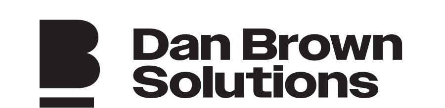

  

<strong>The GitHub home of Dan Brown Solutions</strong>

Dan Brown Solutions builds software, AI tools, and business systems that help organizations become more scalable, efficient, and self-managing.

## Our Brands

  <a href="https://danbrownsolutions.com">Website</a> •
  <a href="https://ddsdashboard.com">DDS Dashboard</a> •
  <a href="https://aipro.gold">AI Pro Gold</a> •
  <a href="https://yourdental.ai">Your Dental AI</a>

### [danbrownsolutions.com](https://danbrownsolutions.com)

The parent brand behind our portfolio of software, AI, marketing, and operational solutions. Dan Brown Solutions focuses on building practical systems that help businesses improve execution, streamline operations, and grow with confidence.

### [blumbergdigital.com](https://www.blumbergdigital.com)

Digital marketing solutions for dental practices, spanning SEO, Google Ads, patient acquisition funnels, and staff training tools designed to help practices attract the right patients and grow.

### [fallofshot.com](https://www.fallofshot.com)

High-impact video production and marketing automation built to help small businesses strengthen their brand, tell their story, and execute more effectively.

### [ddsdashboard.com](https://ddsdashboard.com)

An all-in-one system to help dental practices organize, track, and scale operations with better visibility, stronger workflows, and more effective management tools.

### [companyperiscope.com](https://www.companyperiscope.com)

Custom systems, AI, integrations, and dashboards that help businesses become more scalable and self-managing.

### [yourdental.ai](https://yourdental.ai)

AI-powered tools built for dentists to streamline marketing, training, and operations while supporting a better overall patient experience.

### [aipro.gold](https://aipro.gold)

AI-powered tools that turn business knowledge into usable systems, checklists, workflows, and results—helping teams automate repetitive work and move faster with clarity.

## What We Value

We build products that are:

- Practical and outcome-driven
- Clean, intuitive, and easy to adopt
- Built to improve real-world operations
- Designed to support long-term business growth

## Public Repositories

A few pieces of our work are available publicly here on GitHub:

- [eslint-config-dds](https://github.com/DDS-Dashboard/eslint-config-dds) — shared ESLint flat config for DDS TypeScript projects

We also maintain a small number of public forks when they support our platform and tooling:

- [heroku-buildpack-node-modules-cleanup](https://github.com/DDS-Dashboard/heroku-buildpack-node-modules-cleanup)
- [heroku-buildpack-sourceversion](https://github.com/DDS-Dashboard/heroku-buildpack-sourceversion)
- [nominatim](https://github.com/DDS-Dashboard/nominatim)

---

### Explore our work

- [danbrownsolutions.com](https://danbrownsolutions.com)
- [blumbergdigital.com](https://www.blumbergdigital.com)
- [fallofshot.com](https://www.fallofshot.com)
- [ddsdashboard.com](https://ddsdashboard.com)
- [companyperiscope.com](https://www.companyperiscope.com)
- [yourdental.ai](https://yourdental.ai)
- [aipro.gold](https://aipro.gold)
